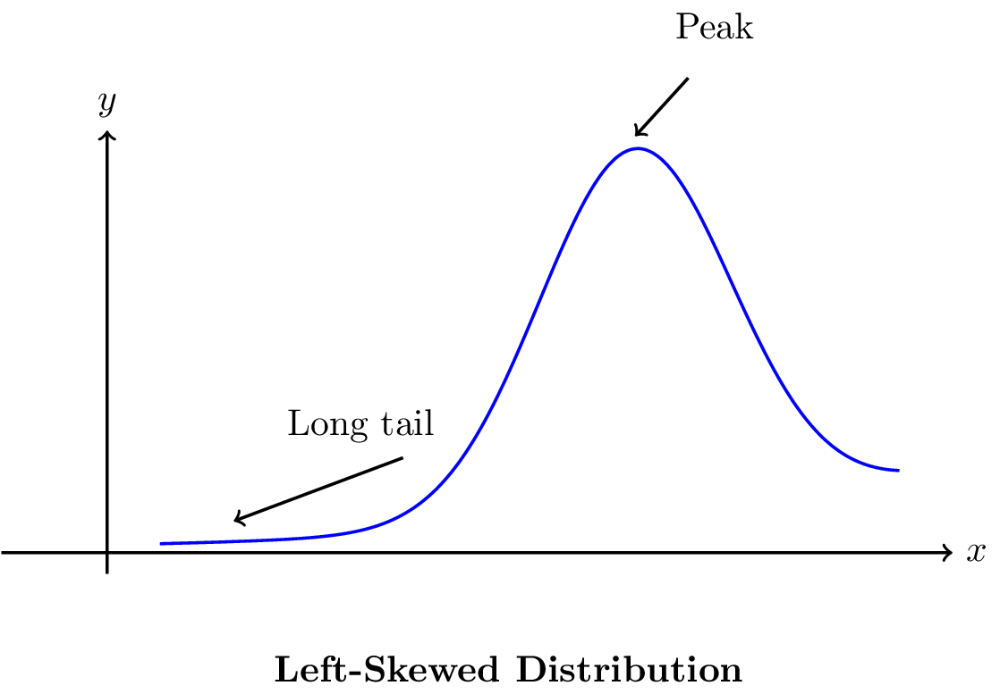
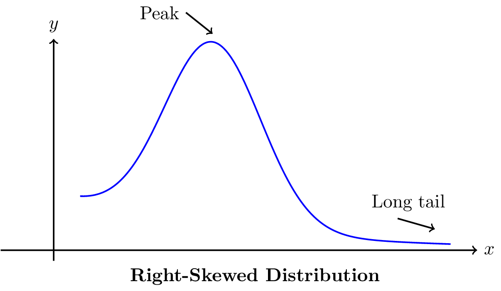
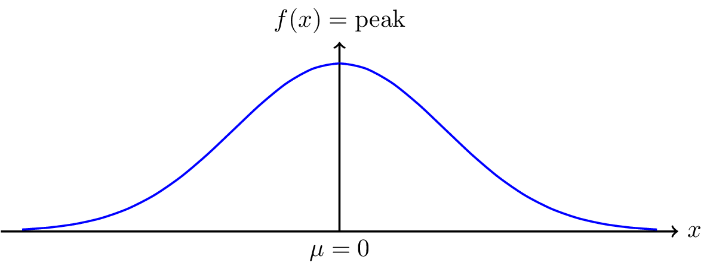
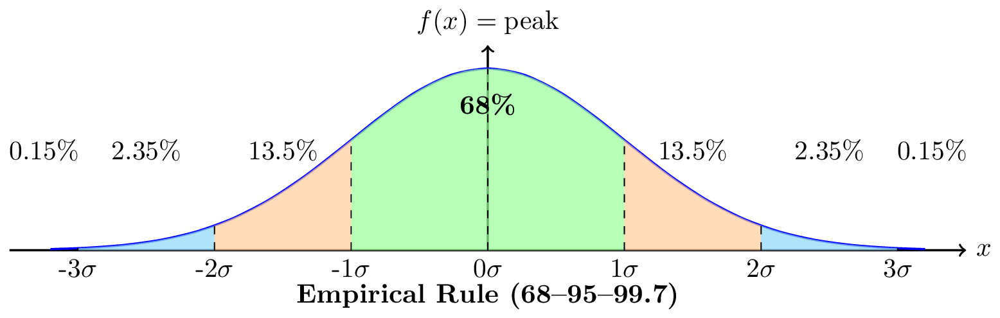
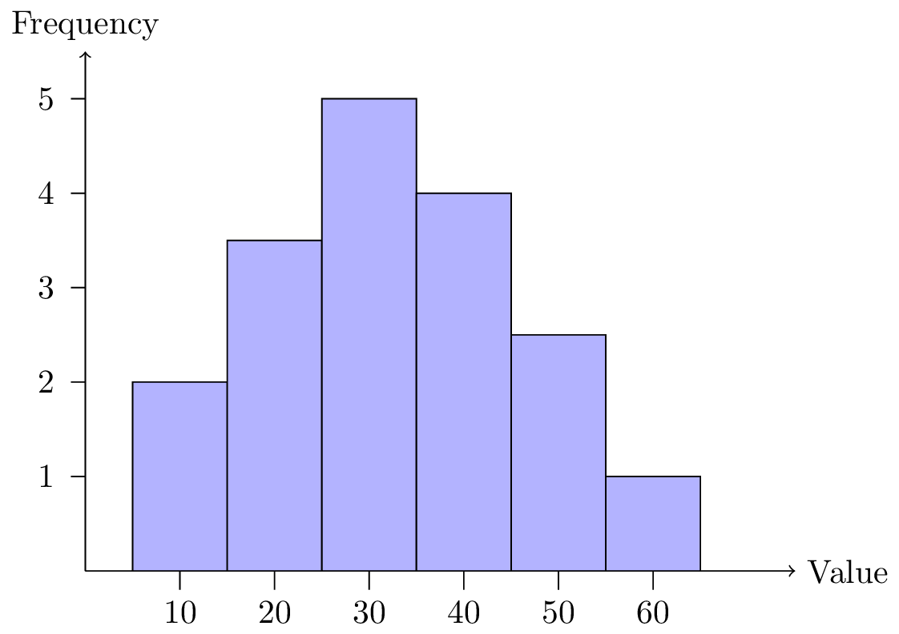
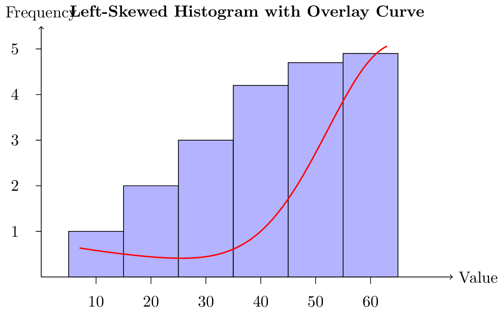
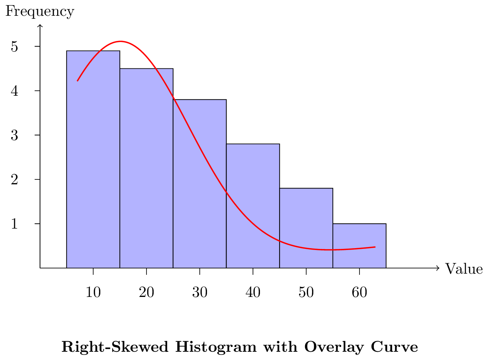
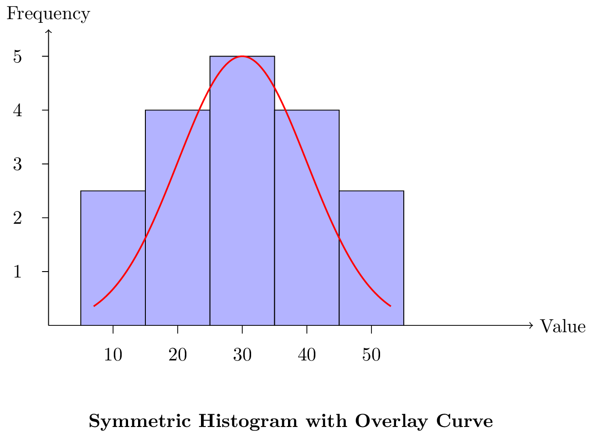

# Descriptive Statistics and an Introduction to R

## Introduction

Intuitively, statistics can be considered the science of uncertainty.
Formally,

::: definition
Statistics is the science of collecting, classifying, summarizing,
analyzing and interpreting data.
:::

**Population, Sample, Parameter**

In statistics, researchers need to observe behavior, pattern, trends and
other types of data to give a conclusion. To make the conclusion more
persuasive, researchers require huge amount of data to support them,
that's why study statistics need population.

::: definition
In statistics, a population is a set of similar observations which is of
interest for some experimental questions. It can be a set of existing
objects such as all people in Canada, or hypothetical group of existing
objects such as the set of all possible hands in a game of poker.
:::

However, data collection from population is a lot work. Usually,
researchers select a finite number of observations to study.

::: definition
It refers to a selection of a subset from population that researchers
use it to estimate population characteristics.
:::

Now, we have already chosen a sample, but how do we use it to estimate
population characteristics? This is the point where parameter comes to
play.

::: definition
A parameter is a quantity of statistical population which summerizes
characteristics of the population. For example, mean, variance and
standard deviation.
:::

**Descriptive and Inferential Statistics**

Now, we have set everything we need. A population, a chosen sample in
that population with its parameters. Next step is studying. There are
two major types of analysis: descriptive and Inferential statistics. In
this section, we are only going to give you a rough idea about what they
are, more detailed materials will be introduced in later chapters.

::: definition
It refers to the summation of all quantitive values that describe
characteristics of the population. Usually, we use descriptive
statistics to summerize characteristics of a data set.
:::

Furthermore, we use inferential statistics to do statistical analysis.

::: definition
It refers to the process of using data analysis to indicate properties
of a population. For example, testing hypothesis and confidence interval
(both will be introduced in later chapters).
:::

**Qualitative and Quantitative Data**

At this point, assume that we have finished all procedures such as
obtaining parameters and analyzing properties. Now, another important
thing is illustrating all the discovery.

::: definition
This type of illustration refers to showing categorical data. For
example, lecture notes from a course, open-question survey.
:::

To illustrate numerical data, we use quantitative data.

::: definition
Unless the previous type of illustration, quantitative data is
represented numerically, including anything that can be counted,
measured, or given a numerical value. For example, STA258 final mark
score range from 100 different students who have taken this course.
:::

## Descriptive Statistics

Previously, we defined descriptive statistics. Now, let's introduce what
exact they are.\
**Sample Mean, Variance and Standard Deviation**

Sample mean (or sample average) is the average value of a sample which
is selected from an interested population of an experiment. Usually, the
sample mean is used to estimate population mean. In other words, we say
that the sample mean is an estimator of population mean.

::: definition
Let $x_1, x_2, x_3, ..., x_n$ be a sample of data points. We define
sample mean of the sample data points ($\bar{x}$) as the following:
$$\bar{x} = \frac{1}{n} \sum_{i=1}^{n} x_i.$$ Also, we define sample
variance of the sample data points ($s^2$) as:
$$s^2 = \frac{1}{n-1} \sum_{i=1}^{n}(x_i - \bar{x})^2.$$ Moreover, the
standard deviation of the sample of data points ($s$) is:
$$s = \sqrt{s^2}, \quad \text{for } s > 0.$$
:::

Now, let's move to variance. It refers to the expected value of the
squared deviation from the mean of a random variable in a population.
Similarly, we do have sample variance as well, which is the expected
value of the squared deviation from the mean of a random variable in a
selected sample. At this point, we can still use sample variance to
estimate population variance with adjustment, because the sample
variance may differ significantly based on what data points are chosen
from that population.

::: definition
Let $x_1, x_2, x_3, ..., x_n$ be a sample of data points, we define
sample variance of the sample data points ($s^2$) as:
$$s^2 = \frac{1}{n-1} \sum_{i=1}^{n}(x_i - \bar{x})^2, \text{ where $\bar{x}$ is the sample mean of the data points.}$$
:::

Next is standard deviation. It is a measure of the amount of variation
of the values of a variable about its mean. If standard deviation is
relatively larger, then data points are widely spread out from the mean.
Otherwise, data points stay close from the mean. Also, standard
deviation is obtained by taking squared root from variance which is
dependent on the choices of data points as well. To use sample standard
deviation as an estimator to population standard deviation, we still
need to adjust it.

::: definition
Let $x_1, x_2, x_3, ..., x_n$ be a sample of data points. The standard
deviation of the sample of data points ($s$) is:
$$s = \sqrt{s^2}, \quad \text{for } s > 0.$$
:::

**Median and Mode**

The median and mode are two important measures of central tendency used
in statistics to summarize and understand data. The median represents
the middle value in a sorted dataset, giving a sense of the center that
is not affected by extreme values or outliers. In contrast, the mode is
the value that appears most frequently in a dataset, making it useful
for identifying common or repeated observations.

::: definition
Let: $x_1, x_2, x_3, ... , x_n$ be a collection of data points which is
arranged in ascending order from the smallest value to the largest value
(or descending order from the largest value to the smallest value in
that collection). The median of the given collection of data points is
the middle value in that collection, which equally spreads the
collection into two parts. Half of all the collection values are above
the median value and the rest of the values in the collection is below
the median value.

- Case 1: when n is an odd number. (i.e. $1, 3, 11, 237,...$). Then, the
  median $M$ is defined as:
  $$M = \frac{n+1}{2} \text{, where n represents the $n^{th}$ position}.$$

- Case 2: when n is an even number (i.e. $2, 6, 100, 500,...$). Then,
  the median $M$ is: the average value of $\frac{n}{2}$'s and
  $\frac{n+2}{2}$'s position, where n represents the $n^{th}$ position.
:::

Now, let's introduce mode.

::: definition
It refers to a value that appears the most frequent than the appearance
of all other values in a given dataset.
:::

**Percentile and Quartile**

Percentiles and quartiles are statistical measures used to describe the
distribution of data. A percentile indicates the value below which a
given percentage of observations fall, helping to understand relative
standing within a dataset. Quartiles, a specific type of percentile,
divide the data into four equal parts (Q1, Q2/median, and Q3), providing
insights into the spread and central tendency.

::: definition
Let: $x_1, x_2, ..., x_n$ be a collection of data points in either
ascending order. Percentile is denoted as: $p^{th}$, which indicates
$p \%$ of observations are below to a such value. Quartiles, are special
cases of percentile which equally spread the collection of data into
four parts. Each part contains $25\%$ of the entire collection. More
specifically, we define quartiles as the following:

- $Q_1$: the $25$ percentile (or $25^{th}$), which shows that $25\%$ of
  the data points are below the value $Q_1$.

- $Q_2$: the $50$ percentile (or $50^{th}$), which shows that $50\%$ of
  the data points are below the value $Q_2$.

- $Q_3$: the $75$ percentile (or $75^{th}$), which shows that $75\%$ of
  the data points are below the value $Q_3$.

- $Q_2$ is qual to median.

Moreover, we use $Q_3 - Q_1$ to calculate interquartile range (I.P.R),
which shows the spread of the whole data set.
:::

**Skewness and Symmetry**

The two terms 'skewness' and 'symmetry' are used to describe the shape
of probability distribution. There are two types of skewness: left (or
negative) skew and right (or positive) skew. In real life, a famous
distribution highly used in hypothesis testing which is $\chi_{n}^{2}$
with $n$ degrees of freedom, is right skewed probability distribution
function. Another example regarding to symmetry is normal distribution
such that its probability under its curve greater than $\mu$ is same as
the probability below than $\mu$. Now let's introduce the proper
definition of skewness and symmetry.

::: definition
Skewness refers to such a measure of the asymmetry of the probability
distribution of a real-valued random variable about its mean. The
skewness value can be positive, zero, negative or undefined.
:::

Now, let's break down the main definition of skewness and symmetry:

::: definition
By observing given probability distribution curve, if the left tail of
the curve is longer than the right tail the mass of the distribution is
concentrated on the right of the figure, then we say that probability
distribution is left skew or negative skew. (See figure below)
:::

<<<<<<< HEAD
knitr::include_graphics(knitr::image_uri("figures/Leftskew.jpg"))
=======
```{r fig-mu1-lt-mu2-1, fig.cap = "An illustration of a left (negative) skewed distribution.", out.width = "80%", echo = FALSE}

```
>>>>>>> BryanImages

::: definition
By observing given probability distribution curve, if the right tail of
the curve is longer than the left tail the mass of the distribution is
concentrated on the left of the figure, then we say that probability
distribution is right skew or positive skew. (See figure below)
:::

```{r fig-rightskew, fig.cap = "An illustration of a right (positive) skewed distribution.", out.width = "80%", echo = FALSE}

```

Symmetry is a special case of skewness when the value of skewness is
$0$.

::: definition
In statistics, symmetry s a probability distribution is reflected around
a vertical line at some value of the random variable represented by the
distribution. Probability under the curve below that value is equal to
probability under the curve greater than that value. (see figure below)
:::

```{r fig-symmetry, fig.cap = "An illustration of symmetric distribution. Area under this curve on the left hand side of $\\mu = 0$ is same as the area on the right hand side under the curve.", out.width = "80%", echo = FALSE}

```

Since symmetry is a special case, so that it has a unique property as
the following:

::: theorem
For any symmetric (bell-shaped) curve, let $\mu$ be its mean and
$\sigma$ be its standard deviation, the following probability set
function is true:

- $1.$ $P(\mu - \sigma < X < \mu + \sigma) = 68.27\%;$

- $2.$ $P(\mu - 2\sigma < X < \mu + 2\sigma) = 95.45\%;$

- $3.$ $P(\mu - 3\sigma < X < \mu + 3\sigma) = 99.73\%.$
:::

```{r fig-erule, fig.cap = "An illustration of the empirical rule.", out.width = "80%", echo = FALSE}

```

**Practice Example**

::: example
Let: $x_1 = 1, x_2 = 3$ and $x_3 = 7$. Calculate the sample mean, sample
variance and sample standard deviation for this collection of data
points.\
Solution (all results are kept in four digits):\
By Definition $1.9 \text{, } 1.10 \text{, } 1.11$, sample mean:
$$\bar{x} = \frac{1+3+7}{3} \approx 3.6667.$$ Then, we use sample mean
to calculate sample variance:
$$s^2 = \frac{1}{3-1} \times [(1-3.6667)^2+(3-3.6667)^2+(7-3.6667)^2] \approx 9.3333.$$
Finally, we take the square root of sample variance to get sample
deviation, and remember that $s > 0$: $$s = \sqrt{s^2} \approx 3.0551.$$
:::

::: example
Given two distinct collections of data points: $S_1$ = $\{2, 4, 6\}$ and
$S_2$ = $\{1, 5, 16, 28\}$. Calculate the median of both two sets.\
Solution:\
For $S_1$, since $n = 3$ which is an odd number, so by
$Definition \text{ } 1.3$, $M_{S_1} = 4$. For $S_2$, $n = 4$ in this
case, so that we need to calculate the average of $\frac{n}{2}$ and
$\frac{n+1}{2}$. Then, $$M_{S_2} = \frac{5+16}{2} = 10.5.$$
:::

::: example
Consider the data set $S =$
$\{4, 25, 30, 30, 30, 32, 32, 35, 50, 50, 50, 55, 60, 74, 110\}$.
Calculate its median and $Q_1$ ($25^{th}$).\
Solution:\
Simply counting the number of data points, $n = 15$, such that $M_{S}$ =
$\frac{15 + 1}{2}$ = $8$. Thus, the $8^{th}$ value in the set which is
$35$.\
Since we know the median of this collection of data points, we just need
to find the median of the lower half of this data, which is exactly
going to be $25$ percentile ($25^{th}$). In the lower half of the given
collection (all values below the median), $n_{lower} = 7$. By
$Definition \text{ } 1.3$, then median of the lower half ($25^{th}$) is
going to be:
$$25^{th} = \frac{7+1}{2} = 4, \text{ the $4^{th}$ position in the data set}.$$
Thus, $Q_1$ ($25^{th}$) $= 30$. To find $Q_3$ ($75^{th}$), apply the
same strategy will guide you to find the correct answer, and we leave
this as an exercise to you.
:::

## Graphical Techniques

In statistics, there are lots of types of graph to illustrate data, for
example histograms and box-plots. This technique is used in the field of
statistics for data visualization. Our objective is to both be able to
identify some classical types of graph and interpret key statistical
values (descriptive statistical values) from it.

### Histograms

**Introduction to Histograms**

Histogram is a graphical representation of data that uses bars to
display the frequency distribution of a dataset. Unlike bar graphs,
which represent categorical data, histograms group numerical data into
intervals (bins) and show how many values fall into each range. This
makes histograms ideal for visualizing the shape, spread, and central
tendency of continuous data, helping identify patterns such as symmetry,
skewness, and outliers.

```{r fig-hist, fig.cap = "An illustration histogram.", out.width = "80%", echo = FALSE}

```

**Advantages and Disadvantages of Histograms**

- Advantages of Histograms:\
  $1.$ Histograms are easily to used for visualise data (relatively). It
  allows us to get the idea of the \"shape\" of distribution (i.e.
  skewness which will be discussed late in this section).\
  $2.$ It is also flexible that people are able to modify bin widths.

- Disadvantages of Histograms:\
  $1.$ It is not suitable for small data sets.\
  $2.$ The values from histograms close to breaking points are likely
  similar, in fact they need to be classified into different bins (i.e.
  Student A and B scores 79 and 80 respectively in STA258, we consider a
  breaking point between 79 and 80. The two students have similar score,
  but student A is $B+$ and student B is $A-$ in GPA from).

**Histograms with Skewness and Symmetry**

A histogram visually represents the distribution of numerical data,
making it a useful tool for assessing skewness and symmetry. It is quite
straightforward to estimate the skewness of histograms by simply drawing
a curve above bins on the histogram.\
For a histogram to have a left (or negative) skew probability
distribution:

```{r fig-histl, fig.cap = "An illustration histogram to have a left (or negative) skew probability distribution.", out.width = "80%", echo = FALSE}

```

For a histogram to have a right (or positive) skew probability
distribution:

```{r fig-histr, fig.cap = "An illustration histogram to have a right (or positive) skew probability distribution.", out.width = "80%", echo = FALSE}

```

For a histogram to have a symmetric probability distribution:

```{r fig-sym, fig.cap = "An illustration of a histogram which has a symmetric probability distribution.", out.width = "80%", echo = FALSE}

```

### Box-Plots

A boxplot (or box-and-whisker plot) is a standardized way to display
data distribution based on a five-number summary: minimum, first
quartile (Q1), median (Q2), third quartile (Q3), and maximum. The box
represents the interquartile range (IQR), while the whiskers show
variability outside Q1 and Q3. Outliers are plotted as individual
points. Boxplots efficiently compare distributions and highlight
skewness, spread, and outliers. (See figure below)


Similar to histograms, we can still obtain information about skewness
and symmetry, by observing the cut from the line of Q2.\
If the median (Q2) cuts the box with upper area smaller than lower area,
then we say that box-plot with left skew probability distribution. Or,
if the median (Q2) cuts the box with upper area larger than lower area,
then we say that box-plot with right skew probability distribution.\
Otherwise, if the median (Q2) cuts the box with upper area equal to
lower area, then we say that box-plot with symmetric probability
distribution.


## Introduction to R

R is used for data manipulation, statistics, and graphics. It is made
of: operations ($+$,$-$, $<$) which is for calculations on vectors,
arrays and matrices; a huge collection of functions; facilities for
making unlimited types quality graphs; user contributed packages (sets
of related functions); the ability to interface with procedures written
in C, C+, or FORTRAN and to write additional primitives. R is also an
open-source computing package which has seen a huge growth in popularity
in the last few years (Please use this website:
https://cran.r-project.org, to download R).\
**What is R-studio?**

RStudio is a relatively new editor specially targeted at R. RStudio is
cross-platform, free and open-source software (Please use:
https://www.rstudio.com, to download Rstudio).\
**Make a Histogram Using R-studio**

This is just a demonstration of how to start and use R-studio.

. First of all, we need to know which dataset are we going to make into
a histogram. In this case, as an example, we are going to use the
waiting time in faithful in R-studio.\
2. For any dataset, use the code: names(faithful) to get it. (inside the
parentheses, type the names of variables you want in faithful dataset)\
3. Then, we proceed with the code: hist(faithful\$waiting) to get a
basic plot.\


. Furthermore, we can also get more information. For example, by keep
proceeding with the code: hist(faithful\$waiting,plot=FALSE)\$breaks,
R-studio will show you all the breaking points between histogram cells.


