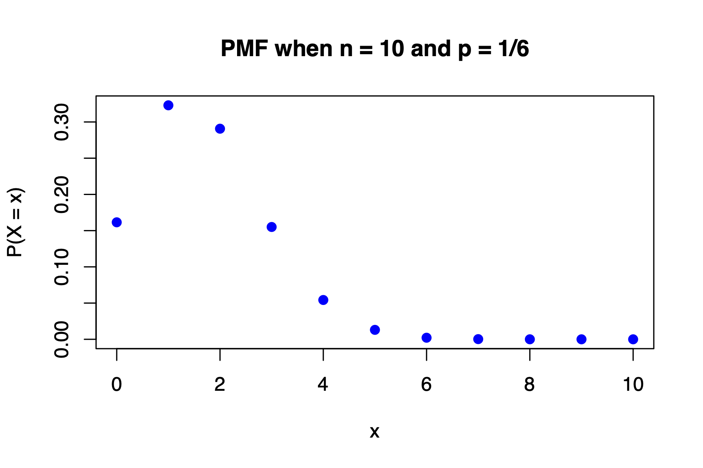
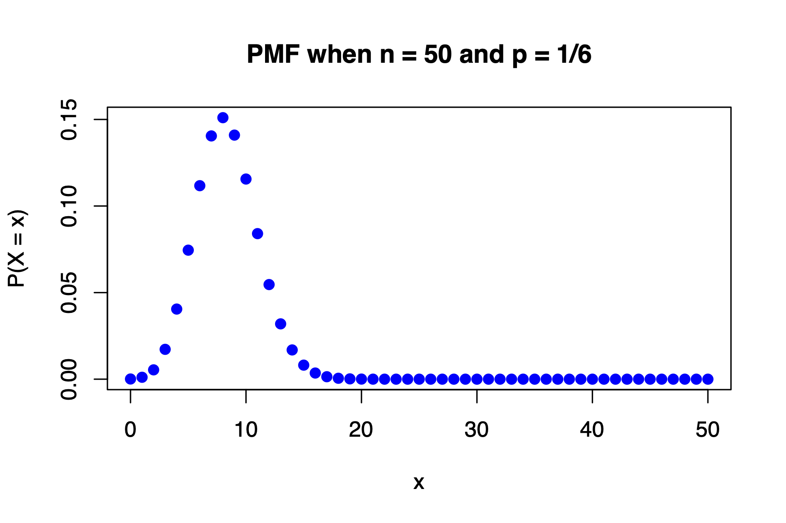
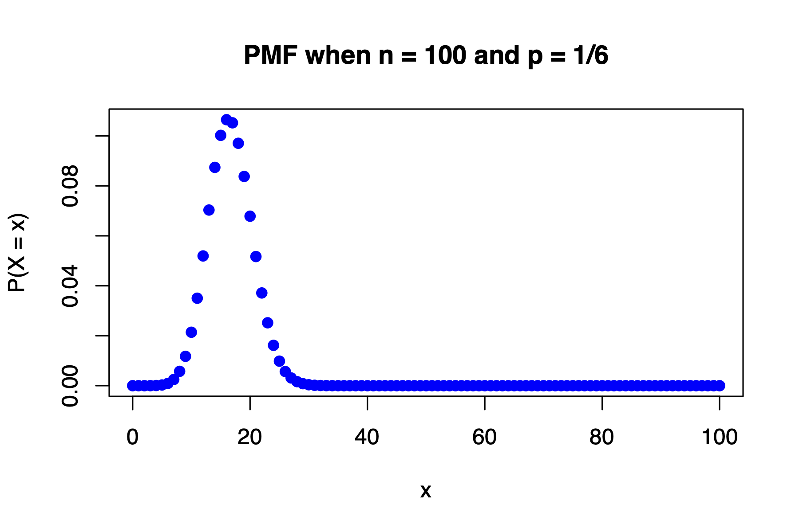
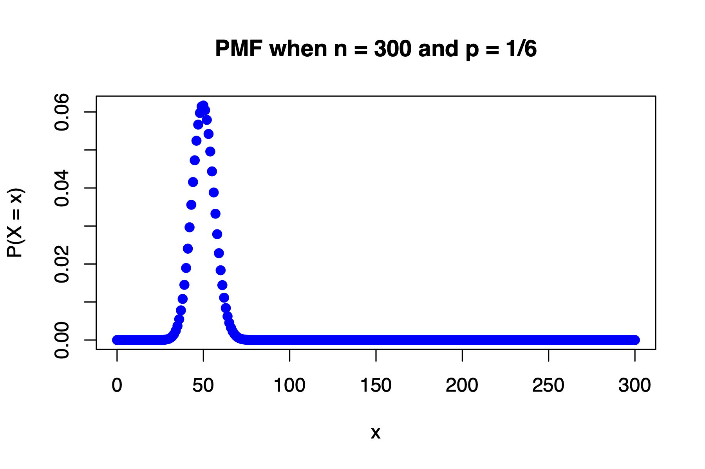
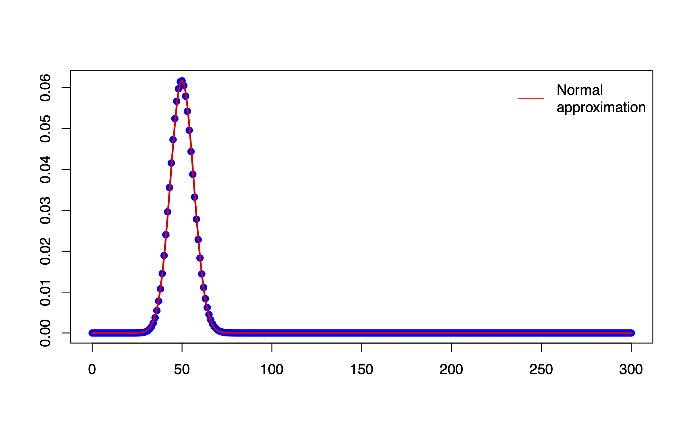

# Normal Approximation to the Binomial Distribution

## Introduction

::: definition
A *statistic* is a function of the observable random variables in a
sample and known constants.

Since statistics are functions of the random variables observed in a
sample, they themselves are random variables. As such, all statistics
have a corresponding probability distribution, which we refer to as
their *sampling distribution*.
:::

:::: tcolorbox
**Bernoulli Distribution:**

A Bernoulli trial is a single experiment with two outcomes:

- Success: $X = 1$ with probability $p$

- Failure: $X = 0$ with probability $1 - p$

::: center
    $X = x$        0       1
  ------------ --------- -----
   $P(X = x)$   $1 - p$   $p$
:::

The probability mass function (PMF) is:
$$f(x) = p^x (1 - p)^{1 - x}, \quad x \in \{0, 1\}$$

**Binomial Distribution:**

A binomial distribution arises from $n$ independent Bernoulli trials.
Let: $$X = \text{number of successes in } n \text{ trials}$$ Then:
$$X \sim \text{Binomial}(n, p)$$

where:

- Each trial results in either success (with probability $p$) or failure
  (with probability $1 - p$)

- $X \in \{0, 1, \dots, n\}$

The PMF is: 
$$
P(X = x) = \textstyle \binom{n}{x} p^x (1 - p)^{n - x}
$$


**Moment Generating Function (MGF):**

The moment generating function (MGF) of a random variable $X$ is defined
as: $$M_X(t) = \mathbb{E}[e^{tX}]$$ The MGF uniquely characterizes the
distribution of $X$ (if it exists in an open interval around 0), and it
can be used to compute moments such as the mean and variance.
::::

## Bernoulli Distribution

Bernoulli random variable is a discrete random variable that has exactly
two possible outcomes which are either a **success** or a **failure**.
An experiment in which there are exactly 2 outcomes (which are success
or failure) is called a **Bernoulli trial**.\
\
When $x = 1$ we have a success and when $x = 0$ we have a failure. The
term success and failure are relative to the problem being studied.

::: tcolorbox
We chose to label a person who refuses to administer the worst shock a
"success" and all others as "failures". However, we could just as easily
have reversed these labels. The mathematical framework we will build
does not depend on which outcome is labeled a success and which a
failure, as long as we are consistent.
:::

Consider the random experiment of rolling a die once. Define the random
variable:

$$X_i =
\begin{cases}
1 & \text{if the } i\text{-th roll is a six}, \\
0 & \text{otherwise}
\end{cases}$$

Then $X_i \sim \text{Bernoulli}(p)$, where
$p = P(\text{rolling a six})$.

::: tcolorbox
*Let $X \sim \text{Bernoulli}(p)$. The mass function of $X$ is*

$$P(X = x) = p^x (1 - p)^{1 - x}, \quad x = 0, 1$$

*where $p$ represents the probability of success.*
:::

::: definition
Let $X \sim \text{Bernoulli}(p)$. The mean of $X$ is $$E(X) = \mu = p$$
and the variance of $X$ is $$\text{Var}(X) = \sigma^2 = p(1 - p)$$
:::

*To support the earlier result, we now provide a derivation of the mean,
variance, and standard deviation of a Bernoulli random variable.*\
Let $X$ be a Bernoulli random variable with the probability of a success
as $p$. Then

$$\begin{aligned}
E[X] = \mu & = \sum_{i=1}^{n} x_i \cdot P(X = x_i) \\
&= 0 \cdot P(X = 0) + 1 \cdot P(X = 1) \\
&= 0 \cdot (1 - p) + 1 \cdot p \\
&= p
\end{aligned}$$ Similarly, the variance of $X$ can be computed:

$$\begin{aligned}
V(X) = \sigma^2 & = \sum_{i=1}^{k} (x_i - \mu)^2 \cdot P(X = x_i) \\
&= (0 - p)^2 \cdot P(X = 0) + (1 - p)^2 \cdot P(X = 1) \\
&= p^2 (1 - p) + (1 - p)^2 p \\
&= p(1 - p)
\end{aligned}$$

The standard deviation is

$$\begin{aligned}
\sigma & = \sqrt{\sigma^2} \\
            & = \sqrt{p(1 - p)}
\end{aligned}$$

## Sampling Distribution of the Sum and MGF Derivation

Consider determining the sampling distribution of the sample total:
$$T_n = X_1 + X_2 + \dots + X_n$$ Suppose
$X_i \overset{iid}{\sim} \text{Bernoulli}(p)$. Then the
moment-generating function of $T_n$ is:

$$\begin{aligned}
M_{T_n}(t) &= \mathbb{E}[e^{t T_n}] \\
           &= \mathbb{E}\left[e^{t(X_1 + X_2 + \dots + X_n)}\right] \\
           &= \mathbb{E}\left[e^{tX_1} e^{tX_2} \dots e^{tX_n} \right] \quad \text{(independence)} \\
           &= \mathbb{E}[e^{tX_1}] \cdot \mathbb{E}[e^{tX_2}] \cdots \mathbb{E}[e^{tX_n}] \\
           &= M_{X_1}(t) \cdot M_{X_2}(t) \cdots M_{X_n}(t) \\
           &= \left[pe^t + (1 - p)\right]^n
\end{aligned}$$

Since this is the MGF of a binomial random variable with parameters $n$
and $p$, we conclude:

$$T_n \sim \text{Binomial}(n, p)$$

::: tcolorbox
We can think of rolling a die $n$ times as an example of the binomial
setting. Each roll gives either a six (a "success") or a number
different from six (a "failure").

Knowing the outcome of one roll doesn't tell us anything about the
others, so the $n$ rolls are independent.

If we call a six a success, then:

- The probability of success on each trial is
  $p = P(\text{rolling a six}) = \frac{1}{6}$

- The probability of failure is $1 - p = \frac{5}{6}$

Let $Y$ be the number of sixes rolled in $n$ trials. Then
$Y \sim \text{Binomial}(n, p)$, and the distribution of $Y$ is called a
**binomial distribution**.
:::

## Binomial Distribution

In section 4.2 we learnt about Bernoulli random variables in which we
were interested in the outcome of just a single trial. A **binomial
random variable** is a generalization of several independent Bernoulli
trials. Instead of performing just a single Bernoulli trial and
observing whether we have a success or not, we are now performing
several Bernoulli trials and observing whether we have a certain number
of successes and failures. The **binomial distribution** describes the
probability of having exactly $k$ successes in $n$ independent Bernoulli
trials with probability of a success $p$.\

::: tcolorbox
*Let $X \sim \text{Bin}(n, p)$. The probability of observing $x$
successes in these $n$ independent trials is given by*

$$P(X = x) = \binom{n}{x} p^x (1 - p)^{n - x}$$

*where*

- $n$ represents the number of trials,

- $x$ represents the number of successes,

- $p$ represents the probability of success on any given trial,

$$\binom{n}{x} = \frac{n!}{x!(n - x)!} \quad \text{is the binomial coefficient.}$$
:::

::: definition
Let $X \sim \text{Bin}(n, p)$. The mean of $X$ is $$E(X) = \mu = np$$
*and the variance of $X$ is* $$\text{Var}(X) = \sigma^2 = np(1 - p)$$
:::

### Visualizing the PMF of Binomial Distributions

**R code:**

::: tcolorbox
    ## Pmf of Binomial with n=10 and p=1/6.

    x <- seq(0, 10, by=1)
    y <- dbinom(x, 10, 1/6)
    
:::

**Probability Mass Functions (PMFs) for increasing $n$:**

The following plots display the probability mass functions (PMFs) for a
binomial distribution with $p = \frac{1}{6}$ and increasing values of
$n$. As $n$ increases, the binomial distribution begins to resemble a
normal distribution.

```{r echo=FALSE, fig.cap="PMF of Binomial distribution with \\(n = 10\\) and \\(p = \\frac{1}{6}\\).", out.width='80%', fig.align='center'}

```
```{r echo=FALSE, fig.cap="PMF of Binomial distribution with \\(n = 50\\) and \\(p = \\frac{1}{6}\\).", out.width='80%', fig.align='center'}

```
```{r echo=FALSE, fig.cap="PMF of Binomial distribution with \\(n = 100\\) and \\(p = \\frac{1}{6}\\).", out.width='80%', fig.align='center'}

```
```{r echo=FALSE, fig.cap="PMF of Binomial distribution with \\(n = 300\\) and \\(p = \\frac{1}{6}\\).", out.width='80%', fig.align='center'}

```

## Sampling Distribution of a Sample Proportion and the Normal Approximation

When studying categorical data, we are often interested not just in
individual outcomes, but in the proportion of successes observed in a
sample. Understanding how this proportion behaves across repeated
samples is crucial for making inferences about a population. In this
section, we explore the sampling distribution of a sample proportion and
how it can be approximated by a normal distribution under certain
conditions.\

Draw a *Simple Random Sample (SRS)* of size $n$ from a large population
that contains proportion $p$ of "successes". Let $\hat{p}$ be the
***sample proportion*** of successes:

$$\hat{p} = \frac{\text{number of successes in the sample}}{n}$$

Then:

- The **mean** of the sampling distribution of $\hat{p}$ is $p$.

- The **standard deviation** of the sampling distribution is
  $\sqrt{ \frac{p(1 - p)}{n} }$.

```{r echo=FALSE, fig.cap="Binomial distribution with \\(n = 300\\), \\(p = \\frac{1}{6}\\), and its Normal approximation.", out.width='80%', fig.align='center'}

```


According to the Central Limit Theorem (CLT), the sampling distribution
of a sample proportion becomes approximately normal as the sample size
increases.

That is:
$$\hat{p} \sim \mathcal{N}\left(p, \sqrt{\frac{p(1 - p)}{n}}\right)$$

This approximation is most accurate when both $np \geq 10$ and
$n(1 - p) \geq 10$.

These are called the **success-failure conditions**.

*Key Point:* When the success-failure conditions are met, the normal
approximation to the sampling distribution of $\hat{p}$ can be used for
probability calculations.

### Conditions for Using the Normal Approximation {#conditions-for-using-the-normal-approximation .unnumbered}

Suppose $X \sim \text{Binomial}(n, p)$. Then:

$$\mu = np, \quad \sigma^2 = np(1 - p)$$

**Binomial probabilities can be approximated by the normal
distribution:** $$X \approx \mathcal{N}(np, \, np(1 - p))$$

This approximation is *useful for large $n$* and valid under the
following conditions:

::: tcolorbox
The binomial setting holds (i.e., independent trials, fixed $n$, same
probability $p$) and

$$np \geq 10 \quad \text{and} \quad np(1 - p) \geq 10$$
:::

Alternatively, a more conservative criterion for using the normal
approximation is:
$$n > 9 \cdot \left( \frac{\max(p, \, 1 - p)}{\min(p, \, 1 - p)} \right)$$

These ensure that the binomial distribution is sufficiently symmetric
and smooth to approximate with the normal distribution.

We derive the sampling distribution of $\hat{p}$ using properties of the
Bernoulli distribution.

### Bernoulli Distribution (Binomial with $n = 1$) {#bernoulli-distribution-binomial-with-n-1 .unnumbered}

$$X_i =
\begin{cases}
1 & \text{if the $i$-th roll is a six} \\
0 & \text{otherwise}
\end{cases}$$

$$\mu = \mathbb{E}(X_i) = p, \quad \sigma^2 = \mathrm{Var}(X_i) = p(1 - p)$$

Let $\hat{p}$ be our estimate of $p$. Note that
$\hat{p} = \frac{1}{n} \sum_{i=1}^{n} X_i = \bar{X}$. Let
$\hat{p} = \frac{\text{\# successes } (X)}{\text{sample size } (n)}$

Recall that for $X \sim \text{Binomial}(n, p)$:
$$X \overset{\cdot}{\sim} \mathcal{N}(np, np(1 - p))$$

Let $\hat{p} = \frac{X}{n}$

##### Mean of $\hat{p}$: {#mean-of-hatp .unnumbered}

$$\mathbb{E}(\hat{p}) = \mathbb{E} \left( \frac{X}{n} \right) = \frac{1}{n} \cdot \mathbb{E}(X) = \frac{1}{n} \cdot np = p$$

##### Variance of $\hat{p}$: {#variance-of-hatp .unnumbered}

$$\mathrm{Var}(\hat{p}) = \mathrm{Var} \left( \frac{X}{n} \right) = \frac{1}{n^2} \cdot \mathrm{Var}(X) = \frac{1}{n^2} \cdot np(1 - p) = \frac{p(1 - p)}{n}$$

By the Central Limit Theorem (CLT), for sufficiently large $n$:
$$\hat{p} \sim \mathcal{N} \left( p, \frac{p(1 - p)}{n} \right)$$

##### Standardization of $\hat{p}$: {#standardization-of-hatp .unnumbered}

$$Z = \frac{\hat{p} - p}{\sqrt{ \frac{p(1 - p)}{n} }}$$

If $n$ is large, then by the Central Limit Theorem:
$$\bar{X} \approx \mathcal{N} \left( \mu, \frac{\sigma}{\sqrt{n}} \right)
\quad \Rightarrow \quad
\hat{p} \sim \mathcal{N} \left( p, \sqrt{\frac{p(1 - p)}{n}} \right)$$

:::::: example
In the last election, a state representative received 52% of the votes
cast. One year after the election, the representative organized a survey
that asked a random sample of 300 people whether they would vote for him
in the next election. If we assume that his popularity has not changed,
what is the probability that more than half the sample would vote for
him?

#### Solution 1 (using Normal Approximation) {#solution-1-using-normal-approximation .unnumbered}

We want to determine the probability that the sample proportion is
greater than $50\%$. In other words, we want to find
$P(\hat{p} > 0.50)$.

We want to determine the probability that the sample proportion is
greater than 50%. In other words, we want to find $P(\hat{p} > 0.50)$.

Thus, we calculate $$\begin{aligned}
P(\hat{p} > 0.50) & = P\left( \frac{\hat{p} - p}{\sqrt{p(1-p)/n}} > \frac{0.50 - 0.52}{0.0288} \right) \\
&= P(Z > -0.69) = 1 - P(Z < -0.69) \quad \text{(Z is symmetric)} \\
&= P(Z > -0.69) = 1 - P(Z > 0.69) \\
&= 1 - 0.2451 = 0.7549.
\end{aligned}$$

If we assume that the level of support remains at 52%, the probability
that more than half the sample of 300 people would vote for the
representative is 0.7549.

**R code (Normal Approximation):**

::: tcolorbox
    1 - pnorm(0.50, mean = 0.52, sd = 0.0288)
    ## [1] 0.7562982
:::

Recall that, `pnorm` will give you the area to the left of 0.50, for a
Normal distribution with mean 0.52 and standard deviation 0.0288.

#### Solution 2 (using Binomial) {#solution-2-using-binomial .unnumbered}

We want to determine the probability that the sample proportion is
greater than 50%. In other words, we want to find $P(\hat{p} > 0.50)$.
We know that $n = 300$ and $p = 0.52$.\
Thus, we calculate $$\begin{aligned}
P(\hat{p} > 0.50) &= P\left(\frac{\sum_{i=1}^{n} x_i}{n} > 0.50\right) \\
&= P\left(\sum_{i=1}^{300} x_i > 150\right) \\
&= 1 - P\left(\sum_{i=1}^{300} x_i \leq 150\right) \\
&\text{(it can be shown that } Y = \sum_{i=1}^{300} x_i \text{ has a Binomial distribution with} \\
&n = 300 \text{ and } p = 0.52\text{)} \\
&= 1 - F_Y(150)
\end{aligned}$$

**R code (using Binomial distribution):**

::: tcolorbox
    1- pbinom(150, size = 300, prob = 0.52);
    ## [1] 0.7375949
:::

Recall that, `pbinom` will give you the CDF at 150, for a Binomial
distribution with $n = 300$ and $p = 0.52$.

### Solution 3 (using continuity correction) {#solution-3-using-continuity-correction .unnumbered}

We have that $n = 300$ and $p = 0.52$. Thus, we calculate
$$\begin{aligned}
P(\hat{p} > 0.50) &= P\left( \frac{\sum_{i=1}^{n} x_i}{n} > 0.50 \right) \\
&= P\left( \sum_{i=1}^{300} x_i > 150 \right) \\
&= 1 - P\left( \sum_{i=1}^{300} x_i \leq 150 \right) \\
&\text{(it can be shown that } Y = \sum_{i=1}^{300} x_i \text{ has a Binomial distribution with} \\
&n = 300 \text{ and } p = 0.52\text{)}. \\
&\approx 1 - P\left( \sum_{i=1}^{300} x_i \leq 150.5 \right) \quad \text{(continuity correction)} \\
&= 1 - P\left( \frac{\sum_{i=1}^{300} x_i}{n} \leq \frac{150.5}{300} \right) \\
&= 1 - P(\hat{p} \leq 0.5017) \\
&= 1 - P\left( Z \leq -0.6354 \right) \quad \text{(Why?)}
\end{aligned}$$ **R code (Normal approximation with continuity
correction):**

::: tcolorbox
    1 - pnorm(0.5017, mean = 0.52, sd = 0.0288)
    ## [1] 0.7374216
:::

Recall that, `pnorm` will give you the area to the left of 0.5017, for a
Normal distribution with mean 0.52 and standard deviation 0.0288.
::::::

## Normal Approximation to Binomial

Let $X = \sum_{i=1}^{n} Y_i$ where $Y_1, Y_2, \ldots, Y_n$ are iid
Bernoulli random variables. Note that $X = n\hat{p}$.

1.  $n\hat{p}$ is approximately Normally distributed provided that
    $np \geq 10$ and $n(1 - p) \geq 10$.

2.  Another criterion is that the Normal approximation is adequate if
    $$n > 9 \left( \frac{\text{larger of $p$ and $q$}}{\text{smaller of $p$ and $q$}} \right)$$

3.  The expected value: $E(\hat{p}) = np$.

4.  The variance: $V(\hat{p}) = np(1 - p) = npq$.

## Continuity Correction

The normal distribution is continuous, while the binomial distribution
is discrete. When we approximate a binomial probability using the normal
distribution, this mismatch can lead to inaccuracy---especially near the
boundaries of discrete values. A continuity correction improves the
approximation by adjusting for this difference. In this section, we
explore how and why this correction is applied.\

### Continuity Correction Table {#continuity-correction-table .unnumbered}

::: center
  **Binomial Probability**                        **Continuity Correction**                                                   **Normal Approximation**                                           
  ------------------------------------ ------------------------------------------------ ----------------------------------------------------------------------------------------------------- -- --
                                                                                                                                                                                                 
  $\displaystyle P(X = x)$              $\displaystyle P(x - 0.5 \leq X \leq x + 0.5)$   $\displaystyle P\left(\frac{x - 0.5 - \mu}{\sigma} \leq Z \leq \frac{x + 0.5 - \mu}{\sigma}\right)$     
                                                                                                                                                                                                 
  $\displaystyle P(X \leq x)$                 $\displaystyle P(X \leq x + 0.5)$                           $\displaystyle P\left(Z \leq \frac{x + 0.5 - \mu}{\sigma}\right)$                      
                                                                                                                                                                                                 
  $\displaystyle P(X < x)$                    $\displaystyle P(X \leq x - 0.5)$                           $\displaystyle P\left(Z \leq \frac{x - 0.5 - \mu}{\sigma}\right)$                      
                                                                                                                                                                                                 
  $\displaystyle P(X \geq x)$                 $\displaystyle P(X \geq x - 0.5)$                           $\displaystyle P\left(Z \geq \frac{x - 0.5 - \mu}{\sigma}\right)$                      
                                                                                                                                                                                                 
  $\displaystyle P(X > x)$                    $\displaystyle P(X \geq x + 0.5)$                           $\displaystyle P\left(Z \geq \frac{x + 0.5 - \mu}{\sigma}\right)$                      
                                                                                                                                                                                                 
  $\displaystyle P(a \leq X \leq b)$    $\displaystyle P(a - 0.5 \leq X \leq b + 0.5)$   $\displaystyle P\left(\frac{a - 0.5 - \mu}{\sigma} \leq Z \leq \frac{b + 0.5 - \mu}{\sigma}\right)$     
                                                                                                                                                                                                 
:::

Suppose that $Y$ has a Binomial distribution with $n = 20$ and
$p = 0.4$. We will find the exact probabilities that $Y \leq y$ and
compare these to the corresponding values found by using two Normal
approximations. One of them, when $X$ is Normally distributed with
$\mu_X = np$ and $\sigma_X = \sqrt{np(1 - p)}$. The other one, $W$, a
shifted version of $X$.

For example, $$P(Y \leq 8) = 0.5955987$$

As previously stated, we can think of $Y$ as having approximately the
same distribution as $X$. $$P(Y \leq 8) \approx P(X \leq 8)
= P\left[ \frac{X - np}{\sqrt{np(1 - p)}} \leq \frac{8 - 8}{\sqrt{20(0.4)(0.6)}} \right]
= P(Z \leq 0) = 0.5$$

$$P(Y \leq 8) \approx P(W \leq 8.5)
= P\left[ \frac{W - np}{\sqrt{np(1 - p)}} \leq \frac{8.5 - 8}{\sqrt{20(0.4)(0.6)}} \right]
= P(Z \leq 0.2282) = 0.5902615$$

::: example
Fifty-one percent of adults in the U. S. whose New Year's resolution was
to exercise more achieved their resolution. You randomly select 65
adults in the U. S. whose resolution was to exercise more and ask each
if he or she achieved that resolution. What is the probability that
exactly forty of them respond yes?\
We are given that $p = 0.51$, $n = 65$, and we want to find $P(X = 40)$
where $X \sim Binomial(n = 65, p = 0.51)$.\
**Use Normal Approximation** We use normal approximation to the
binomial. First, compute the mean and standard deviation:
$$\begin{aligned}
\mu &= np = 65 \times 0.51 = 33.15 \\
\sigma^2 &= np(1-p) = 65 \times 0.51 \times 0.49 = 16.485 \\
\sigma &= \sqrt{16.485} \approx 4.06
\end{aligned}$$

We apply continuity correction: $$P(X = 40) = P(39.5 \leq X \leq 40.5)$$

$$= P\left(\frac{39.5 - 33.15}{4.06} \leq Z \leq \frac{40.5 - 33.15}{4.06}\right) = P(1.56 \leq Z \leq 1.81)$$

From the standard normal table:
$$= P(Z \leq 1.81) - P(Z \leq 1.56) = 0.0594 - 0.0352 = 0.0242$$

So the approximate probability is: $$P(X = 40) \approx 0.0242$$
:::
