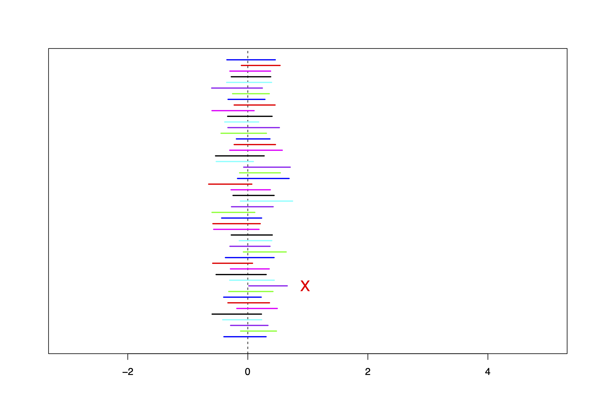
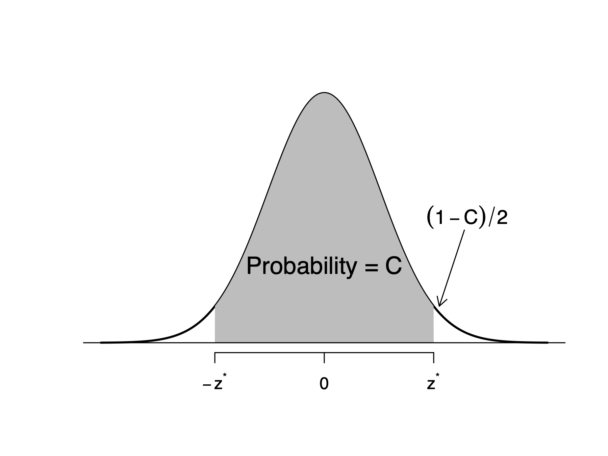

# One Sample Confidence Intervals on a Mean When the Population Variance is Known

## Introduction

Statistical inference is concerned primarily with understanding the
quality of parameter estimates. For example, a classic inferential
question is, "How sure are we that the estimated mean, $\bar{x}$, is
near the true population mean, $\mu$?" While the equations and details
change depending on the setting, the foundations for inference are the
same throughout all of statistics. We introduce these common themes by
discussing inference about the population mean, $\mu$, and set the stage
for other parameters and scenarios. Some advanced considerations are
discussed. Understanding this chapter will make the rest of this book,
and indeed the rest of statistics, seem much more familiar.

::: definition
**Population:** A group of interest (typically large).

**Sample:** A subset of a population.

**Parameter (of population):** A numerical characteristic of a
population. These are usually [unknown]{style="color: blue"} in
real-life settings.\
$\mu$: population mean\
$\sigma^2$: population variance\
$\sigma$: population standard deviation\
[Note: Different from a parameter of a
distribution.]{style="color: blue"}

**Statistic (of sample):** A numerical characteristic of a sample, which
is calculated and known (i.e., a function of the data).\
$\bar{x}$: sample mean\
$s^2$: sample variance\
$s$: sample standard deviation\
**Statistical Inference:** Use statistics (known) to make conclusions on
parameters (unknown) and quantify the degree of certainty of statements
made.
:::

The sample mean, $\bar{x} = \frac{1}{n} \sum_{i=1}^{n} x_i$, is a number
we use to estimate the population mean, $\mu$. This is called a **point
estimate**.

But, we know it's not equal to $\mu$. Then, we'd rather estimate the
population mean using an **interval estimate** that gives a *range of
real numbers* that we hope contains the population mean, $\mu$.

::: example
- $\bar{x}$ is a point estimate of $\mu$

- $s^2$ is a point estimate of $\sigma^2$

- $s$ is a point estimate of $\sigma$

[*(All calculated with data from a sample)*]{style="color: blue"}
:::

Due to the nature of randomness and calculating based on a subset,
statistics are not guaranteed to be exactly equal to parameters.

Therefore, we create [intervals]{.underline} around statistics which we
believe capture the parameter.

::: definition
A confidence interval is a plausible range of values that captures a
parameter with a quantified degree of confidence.
:::

<figure>

<figcaption>Parameter location within the interval.</figcaption>
</figure>

Suppose we are interested in the average mark for `STA258` for the
current semester. We are 100% confident that the average mark is between
0 and 100; however, this is not useful information as we already know
that the average mark must lie between 0 and 100. Using the marks of
previous years, we can construct a 95% interval for the average mark. If
it is determined that the average mark lies within 70% and 80%, this is
much more meaningful as we can state with a high degree of certainty
that the average mark is going to lie within a substantially narrow
range.

In this course, all confidence intervals have the same basic skeleton:

::: tcolorbox
$$\textit{estimator} \pm 
\underbrace{
\left(
\textit{value from reference distribution}
\right)
\times 
\left(
\textit{standard error of estimate}
\right)
}_{\text{\textit{margin of error}}}$$
:::

The value from the reference distribution in the skeleton above will be
either a value from the standard normal distribution or the Student
*t*-distribution. The margin of error (*MOE*) can be considered as the
distance around our estimator in which the true value of the parameter
of interest will be found, with a specified level of confidence.

<figure id="figureVisualization of CI">
<div class="center">

</div>
<figcaption>Visualization of a confidence interval on the real number
line. The margin of error is abbreviated as <span
class="math inline"><em>M</em><em>O</em><em>E</em></span>. The estimator
is the centre of the interval. The confidence interval consists of all
values between the estimator<span
class="math inline">−<em>M</em><em>O</em><em>E</em></span> and the
estimator<span
class="math inline">+<em>M</em><em>O</em><em>E</em></span>.</figcaption>
</figure>

## Interpretation

We use very specific language when we interpret a confidence interval.

::: tcolorbox
*Suppose we construct a $C\%$ confidence interval for some parameter
such that $C$ is between 0 and 100. In repeated sampling, we are $C\%$
confident that approximately $C\%$ of the intervals will capture the
true value of the parameter.*
:::

By this we mean that if we constructed several $C\%$ confidence
intervals using different samples (with or without replacing the units),
then we should expect approximately $C\%$ of these intervals to capture
the parameter of interest. For example suppose we construct 1000 95%
confidence intervals for the population mean $\mu$. We would expect
approximately 95% of these 1000 intervals
(i.e. $95\% \times 1000 = 950$) to actually capture $\mu$.

::: nt
A more intuitive but equivalent interpretation is to state that we are
$C$% confident that our target parameter is inside the interval
constructed.
:::

It is incorrect to state that there is a $C\%$ probability that the
interval we constructed contains the parameter of interest. We assume
that the value of a parameter is fixed. Therefore when we construct a
confidence interval, the interval either contains the parameter or it
does not.

## Confidence Interval for $\mu$ (Known Variance)

When we know the population standard deviation $\sigma$, we can
construct a confidence interval for $\mu$ in the following manner.

::: tcolorbox
*A $(100 - \alpha)\%$ confidence interval on $\mu$ when $\sigma$ is
known is*
$$\bar{x} \; \pm \; z_{\alpha/2} \left( \frac{\sigma}{\sqrt{n}} \right)$$
:::

The $z_{\alpha/2}$ value is obtained from standard normal tables. The
standard error is $\frac{\sigma}{\sqrt{n}}$ and the margin of error is
$z_{\alpha/2} \left( \frac{\sigma}{\sqrt{n}} \right)$.\
Let $X_1, X_2, ..., X_n$ be iid $N(\mu, \sigma^2)$, where $\mu$ is
unknown and $\sigma$ is known.

We know that:
$$Z = \frac{\bar{X} - \mu}{\sigma / \sqrt{n}} \sim N(0, 1)$$ and
$$P(-1.96 < Z < 1.96) = 0.95$$ Therefore:
$$P\left( -1.96 < \frac{\bar{X} - \mu}{\sigma / \sqrt{n}} < 1.96 \right) = 0.95
\Rightarrow P\left( \bar{X} - 1.96 \frac{\sigma}{\sqrt{n}} < \mu < \bar{X} + 1.96 \frac{\sigma}{\sqrt{n}} \right) = 0.95$$

**Interpretation of Confidence Interval:**

- This is a random interval $\bar{X} \pm 1.96 \frac{\sigma}{\sqrt{n}}$

- The interval is random since $\bar{X}$ is random due to sampling.

- The population mean $\mu$ is a fixed, but unknown, number.

- The probability $\mu$ is inside the random interval is 0.95 (success
  rate of the method).

- 95% of all samples give an interval that captures $\mu$, and 5% do
  not.

Once we observe our sample:

- This is **not** a random interval
  $\bar{X} \pm 1.96 \frac{\sigma}{\sqrt{n}}$

- The probability $\mu$ is inside this interval is either 1 or 0

**Confidence Interval Isn't Always Right:**

Not all CIs contain the true value of the parameter. This can be
illustrated by plotting many intervals simultaneously and observing.

**R Output:**

::: tcolorbox
    ## Step 1. Generate random samples;
    set.seed(2017)
    m = 50;       # m = number of samples;
    n = 25;       # n = number of obs in sample;
    mu.i = 0;     # mu.i = mean of obs;
    sigma.i = 5;  # sigma.i = std. dev. of obs;

    mu.total = n * mu.i;          # mean of Total;
    sigma.total = sqrt(n) * sigma.i;  # std. dev. of Total;
:::

::: tcolorbox
    ## Step 2. Construct CIs;
    xbar = rnorm(m, mu.total, sigma.total) / n;
    SE = sigma.i / sqrt(n);

    alpha = 0.10;
    z.star = qnorm(1 - alpha / 2);
:::

::: tcolorbox
    ## Step 3. Graph CIs;
    matplot(rbind(xbar - z.star * SE, xbar + z.star * SE),
            rbind(1:m, 1:m),
            type = "l", lty = 1,
            xlab = " ", lab = " ");
    abline(v = 0, lty = 2);
:::

```{r echo=FALSE, out.width='80%', fig.align='center',fig.cap="Simulated 95% confidence intervals for the population mean."}

```


## Confidence Interval for the Mean of a Normal Population {#confidence-interval-for-the-mean-of-a-normal-population .unnumbered}

Draw an SRS (Simple Random Sample) of size $n$ from a Normal population
having unknown mean $\mu$ and **known** standard deviation $\sigma$. A
level $C$ confidence interval for $\mu$ is:

$$\bar{x} \pm z_{\ast} \cdot \frac{\sigma}{\sqrt{n}}$$

The critical value $z_{\ast}$ is illustrated in a Figure below and
depends on $C$.

```{r echo=FALSE, out.width='80%', fig.align='center',fig.cap="The central area under the standard normal curve with confidence level \\(C\\)."}

```

## Large Sample CI for $\mu$ (Normal data) {#large-sample-ci-for-mu-normal-data .unnumbered}

When we have a large sample from a Normal distribution, the confidence
interval for the population mean $\mu$ can be approximated by the
formula: $$\bar{x} \pm z_{\alpha/2} \cdot \frac{\sigma}{\sqrt{n}}$$

This formula is valid under the following assumptions:

- $n$ large

- random sample from a Normal distribution

- independent observations

Some definitions:

- $1 - \alpha$ is the confidence coefficient

- $100(1 - \alpha)\%$ is the confidence level

## One Sample CI on the Population Mean $\mu$ {#one-sample-ci-on-the-population-mean-mu .unnumbered}

To construct a confidence interval for the population mean, we rely on
several important assumptions:

- When population standard deviation $\sigma$ is **known**

- Formula: $\bar{x} \pm z_{\alpha/2} \cdot \frac{\sigma}{\sqrt{n}}$

- Margin of error comes from standard normal and standard error

How to find $z_{\alpha/2}$?

Example: Find $z_{\alpha/2}$ for a 95% CI on $\mu$:
$$1 - \alpha = 0.95, \quad \alpha = 0.05, \quad \alpha/2 = 0.025$$
$$z_{\alpha/2} = 1.96 \quad (\text{from table or R: } \texttt{qnorm(0.975)})$$

## Table of Common $z$-values {#table-of-common-z-values .unnumbered}

::: center
   Confidence coefficient   Confidence level    $z$
  ------------------------ ------------------ -------
            0.90                  90%          1.645
            0.95                  95%          1.96
            0.99                  99%          2.576
:::

::: example
Playbill magazine reported that the mean annual household income of its
readers is \$119,155. Assume this estimate is based on a sample of 80
households, and that the population standard deviation is known to be
$\sigma = 30{,}000$.

- $\bar{x} = 119{,}155$

- $n = 80$

- $\sigma = 30{,}000$

**Tasks:**

1.  Develop a 90% confidence interval estimate of the population mean.

2.  Develop a 95% confidence interval estimate of the population mean.

3.  Develop a 99% confidence interval estimate of the population mean.

**90% CI Calculation**

$$\bar{x} \pm z_{\alpha/2} \cdot \frac{\sigma}{\sqrt{n}} = 119{,}155 \pm 1.645 \cdot \frac{30{,}000}{\sqrt{80}}$$
$$= 119{,}155 \pm 5{,}500.73$$ $$= (113{,}654.27, \; 124{,}655.73)$$

**95% CI Calculation**

$$\bar{x} \pm z_{\alpha/2} \cdot \frac{\sigma}{\sqrt{n}} = 119{,}155 \pm 1.96 \cdot \frac{30{,}000}{\sqrt{80}}$$
$$= 119{,}155 \pm 6{,}574.04$$ $$= (112{,}580.96, \; 125{,}729.04)$$

**99% CI Calculation**

$$\bar{x} \pm z_{\alpha/2} \cdot \frac{\sigma}{\sqrt{n}} = 119{,}155 \pm 2.576 \cdot \frac{30{,}000}{\sqrt{80}}$$
$$= 119{,}155 \pm 8{,}620.04$$ $$= (110{,}534.96, \; 127{,}775.04)$$

**Interpretation**

We are 99% confident the mean household income of magazine readers is
between \$110,534.96 and \$127,775.04.
:::

::::: example
**Scenario:**

The number of cars sold annually by used car salespeople is known to be
**normally distributed**, with a population standard deviation of
$\sigma = 15$. A random sample of $n = 15$ salespeople was taken, and
the number of cars each sold is recorded below. Construct a **95%
confidence interval** for the population mean number of cars sold, and
provide an interpretation.

**Raw data:**

$$\begin{matrix}
79 & 43 & 58 & 66 & 101 \\
63 & 79 & 33 & 58 & 71 \\
60 & 101 & 74 & 55 & 88 \\
\end{matrix}$$

The sample mean is:

$$\bar{x} = \frac{79 + 43 + \cdots + 55 + 88}{15} = 68.6$$

**R function:**

::: tcolorbox
    simple.z.test = function(x, sigma, conf.level = 0.95) {
      n = length(x);
      xbar = mean(x);
      alpha = 1 - conf.level;
      zstar = qnorm(1 - alpha/2);
      SE = sigma / sqrt(n);
      xbar + c(-zstar * SE, zstar * SE);
    }
:::

**R output:**

::: tcolorbox
    # Step 1. Entering data;
    cars = c(79, 43, 58, 66, 101, 63, 79,
             33, 58, 71, 60, 101, 74, 55, 88)

    # Step 2. Finding CI;
    simple.z.test(cars, 15)

    ## [1] 61.00909 76.19091
:::

**Interpretation:** **We estimate that the mean number of cars sold
annually by all used car salespeople lies between 61 and 76,
approximately. This type of estimate is correct 95% of the time.**
:::::

::: tcolorbox
- Large samples where population is **normal**.

- Large samples where population is **not normal** (By CLT).

- Small samples where population is **normal**.

*Note: A sample is considered large if $n \geq 30$.*
:::

::: example
Suppose a student measuring the boiling temperature of a certain liquid
observes the readings (in degrees Celsius) 102.5, 101.7, 103.1, 100.9,
100.5, and 102.2 on 6 different samples of the liquid. He calculates the
sample mean to be 101.82. If he knows that the distribution of boiling
points is Normal, with standard deviation 1.2 degrees, what is the
confidence interval for the population mean at a 95% confidence level?\
:::

**A confidence interval** uses sample data to estimate an unknown
population parameter with an indication of how accurate the estimate is
and of how confident we are that the result is correct.

The **interval** often has the form\
estimate $\pm$ margin of error

The **confidence level** is the success rate of the method that produces
the interval. A level $C$ **confidence interval for the mean** $\mu$ of
a Normal population with **known** standard deviation $\sigma$, based on
an SRS of size $n$, is given by
$$\bar{x} \pm z^\star \frac{\sigma}{\sqrt{n}}$$

The **critical value** $z^\star$ is chosen so that the standard Normal
curve has area $C$ between $-z^\star$ and $z^\star$.\
Other things being equal, the **margin of error** of a confidence
interval gets smaller as

- the confidence level $C$ decreases,

- the population standard deviation $\sigma$ decreases, and

- the sample size $n$ increases.

## APPENDIX

Interval estimators are commonly called **confidence intervals**. The
upper and lower endpoints of a confidence interval are called the
**upper** and **lower confidence limits**, respectively. The probability
that a (random) confidence interval will enclose $\theta$ (a fixed
quantity) is called the **confidence coefficient**.\
Suppose that $\hat{\theta}_L$ and $\hat{\theta}_U$ are the (random)
lower and upper confidence limits, respectively, for a parameter
$\theta$. Then, if
$$P(\hat{\theta}_L \leq \theta \leq \hat{\theta}_U) = 1 - \alpha,$$ the
probability $(1 - \alpha)$ is the **confidence coefficient**.

### Pivotal quantities {#pivotal-quantities .unnumbered}

One very useful method for finding confidence intervals is called the
**pivotal method**. This method depends on finding a pivotal quantity
that possesses two characteristics:

- It is a function of the sample measurements and the unknown parameter
  $\theta$, where $\theta$ is the **only** unknown quantity.

- Its probability distribution does not depend on the parameter
  $\theta$.
