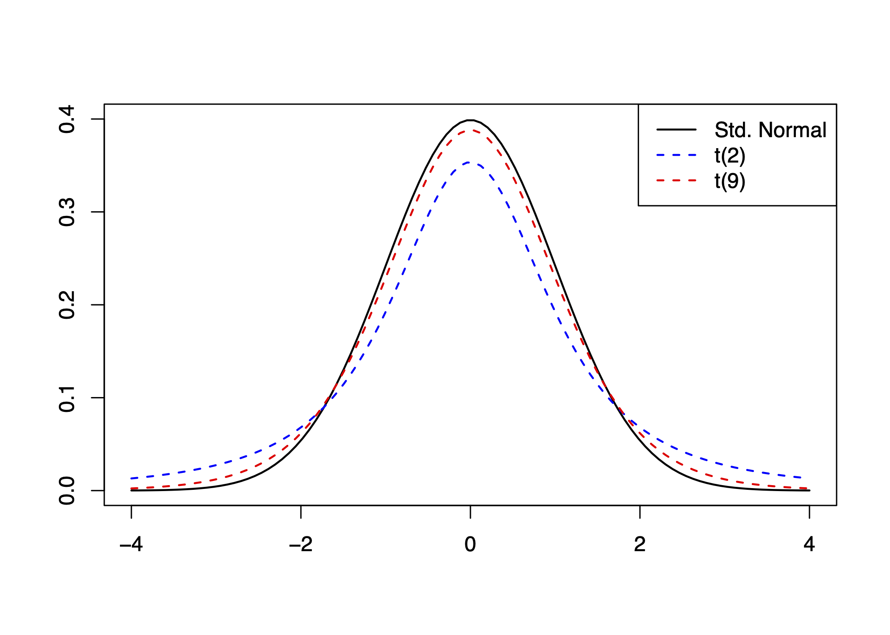
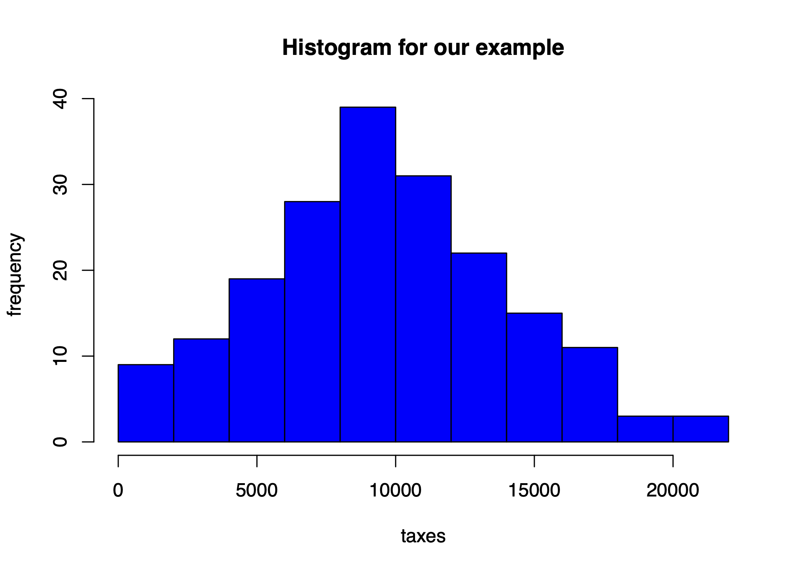
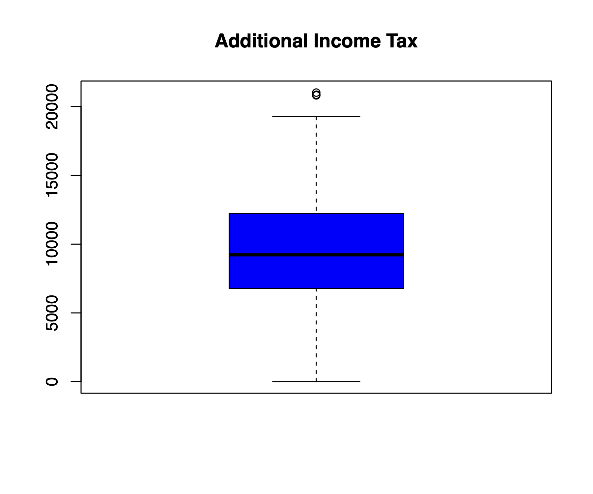
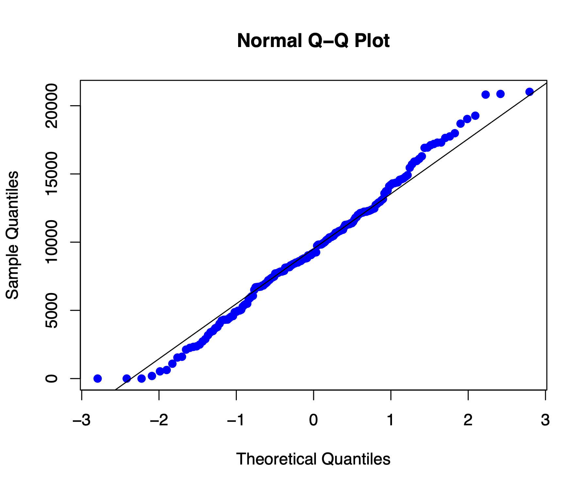

# One-Sample Confidence Intervals on a Mean When the Population Variance is Unknown

## CIs for $\mu$

::: definition
Let $\mu$ be the population mean. When the population standard deviation
$\sigma$ is known and the sample size is large, a confidence interval
for $\mu$ is given by:
$$\bar{Y} \pm z_{\alpha/2} \left( \frac{\sigma}{\sqrt{n}} \right)$$ This
interval is valid under the following conditions:

- The sample is random.

- The observations are independent and identically distributed (i.i.d).

- The sample size $n$ is large enough for the Central Limit Theorem
  (CLT) to apply.
:::

::: definition
Let $\mu$ be the population mean. When the population standard deviation
is unknown and the sample size is small, a confidence interval for $\mu$
is given by:
$$\bar{Y} \pm t_{\alpha/2} \left( \frac{S}{\sqrt{n}} \right), \quad \nu = n - 1$$
This interval is valid under the following conditions:

- The observations are independent and identically distributed (i.i.d).

- The sample is random.

- The population **must** follow a Normal distribution (CLT does not
  apply).
:::

### Independence Assumption {#independence-assumption .unnumbered}

The data values should be independent. There's really no way to check
independence of the data by looking at the sample, but we should think
about whether the assumption is reasonable.

### Randomization Condition {#randomization-condition .unnumbered}

The data arise from a random sample or suitably randomized experiment.
Randomly sampled data --- especially data from a Simple Random Sample
--- are ideal.

::: tcolorbox
- For very small samples ($n < 15$ or so), the data should follow a
  Normal model pretty closely. If you do find outliers or strong
  skewness, don't use this method.

- For moderate samples ($n$ between 15 and 40 or so), the t-method will
  work well as long as the data is unimodal and reasonably symmetric.
  Make a histogram, boxplot, or Q--Q plot to check.

- When the sample size is larger than 40 or 50, the t-method is safe to
  use unless the data are extremely skewed. Make a histogram, boxplot,
  or Q--Q plot to check.
:::

### Standard Error {#standard-error .unnumbered}

When the standard deviation of a statistic is estimated from data, the
result is called the *standard error* of the statistic. The standard
error of the sample mean $\bar{x}$ is $$\frac{s}{\sqrt{n}}.$$

::: tcolorbox
- The density curves of the *t* distributions are similar in shape to
  the Standard Normal curve. They are symmetric about 0, single-peaked,
  and bell-shaped.

- The spread of the *t* distributions is a bit greater than that of the
  Standard Normal distribution. The *t* distributions have more
  probability in the tails and less in the center than the Standard
  Normal. This is because substituting the estimate $s$ for the fixed
  parameter $\sigma$ introduces more variation into the statistic.

- As the degrees of freedom increase, the *t* density curve approaches
  the $N(0, 1)$ curve more closely. This happens because $s$ estimates
  $\sigma$ more accurately as the sample size increases. So using $s$ in
  place of $\sigma$ causes little extra variation when the sample is
  large.
:::
```{r echo=FALSE, fig.cap="Comparison of the standard normal distribution and t-distributions with 2 and 9 degrees of freedom.", out.width='80%', fig.align='center'}

```


:::::: example
The composition of the Earth's atmosphere may have changed over time. To
study the nature of the atmosphere long ago, scientists examined the gas
in air bubbles trapped in ancient amber. Amber is fossilized tree resin
that preserved the atmospheric gases at the time it was formed.

Measurements on amber specimens from the late Cretaceous era (75 to 95
million years ago) give the following percent values of nitrogen:

::: center
63.4, 65.0, 64.4, 63.3, 54.8, 64.5, 60.8, 49.1, 51.0
:::

Assume these observations are a simple random sample (SRS) from the
population of all ancient air bubbles. Construct a **90% confidence
interval** to estimate the mean percent of nitrogen in ancient air.
(Today's atmosphere contains about 78.1% nitrogen.)

**Solution:**

Let $\mu$ represent the true mean percent of nitrogen in ancient air. We
compute a 90% confidence interval for $\mu$ using the sample data.

Given:
$$\bar{x} = 59.5888, \quad s = 6.2552, \quad n = 9, \quad t^* = 1.860 \quad (\text{df} = 8)$$

$$59.5888 \pm 1.860 \left( \frac{6.2552}{\sqrt{9}} \right) = 59.5888 \pm 3.8782$$

$$\boxed{55.7106 \text{ to } 63.4670}$$

**R code:**

::: tcolorbox
    # Step 1: Entering the data
    nitrogen <- c(63.4, 65.0, 64.4, 63.3, 54.8, 64.5, 60.8, 49.1, 51.0)

    # Step 2: Constructing the 90% confidence interval
    t.test(nitrogen, conf.level = 0.90)
:::

**R output:**

::: tcolorbox
    One Sample t-test

    data:  nitrogen
    t = 28.578, df = 8, p-value = 2.43e-09
    alternative hypothesis: true mean is not equal to 0
    90 percent confidence interval:
     55.71155 63.46622
    sample estimates:
    mean of x 
      59.58889 
:::
::::::

:::::: example
Most owners of digital cameras store their pictures on the camera. Some
will eventually download these to a computer or print them using their
own printers or a commercial printer. A film-processing company wanted
to know how many pictures were stored on cameras.

A random sample of 10 digital camera owners produced the following data:

::: center
25, 6, 22, 26, 31, 18, 13, 20, 14, 2
:::

Estimate with **95% confidence** the mean number of pictures stored on
digital cameras.

---

**Solution:**

We are given raw data with $n = 10$ and no information about the
population standard deviation, so we construct a confidence interval for
the population mean using the t-distribution.

**Step 1: Compute sample statistics**

- Sample mean: $\bar{x} = \dfrac{177}{10} = 17.7$

- Sample variance (method 1 -- direct):
  $$s^2 = \dfrac{\sum (x_i - \bar{x})^2}{n - 1} = \dfrac{742}{9} = 82.4556$$

- Sample standard deviation: $$s = \sqrt{82.4556} = 9.081$$

**Step 2: Find the critical value**

For a 95% confidence interval with $n = 10$, degrees of freedom = 9.
From the t-distribution table: $$t_{(9, 0.025)} = 2.262$$

**Step 3: Construct the confidence interval**

$$\bar{x} \pm t^* \cdot \dfrac{s}{\sqrt{n}} = 17.7 \pm 2.262 \cdot \dfrac{9.081}{\sqrt{10}} = 17.7 \pm 6.495$$

$$\boxed{11.205 \text{ to } 24.195}$$

**Interpretation:**

We are 95% confident that the mean number of images stored on digital
cameras is between 11.205 and 24.195.

---

**R code:**

::: tcolorbox
    # Step 1: Entering data
    dataset <- c(25, 6, 22, 26, 31, 18, 13, 20, 14, 2)

    # Step 2: Finding 95% confidence interval
    t.test(dataset, conf.level = 0.95)
:::

**R output:**

::: tcolorbox
    One Sample t-test

    data:  dataset
    t = 6.164, df = 9, p-value = 0.0001659
    alternative hypothesis: true mean is not equal to 0
    95 percent confidence interval:
     11.2042 24.1958
    sample estimates:
    mean of x 
         17.7 
:::
::::::

:::::: example
A manufacturing company produces electric insulators. If the insulators
break when in use, a short circuit is likely. To test the strength of
the insulators, destructive testing is performed to determine how much
force (in pounds) is required to break them.

The following dataset consists of force values (in pounds) recorded for
a random sample of 30 insulators:

::: center
1870, 1728, 1656, 1610, 1634, 1784, 1522, 1696, 1592, 1662, 1866, 1764,
1734, 1662, 1734, 1774, 1550, 1756, 1762, 1866, 1820, 1744, 1788, 1688,
1810, 1752, 1680, 1810, 1652, 1736
:::

Construct a **95% confidence interval** for the population mean force
required to break the insulators.

**Solution:**

We want a confidence interval for the population mean $\mu$, where
$\mu =$ mean force required to break electric insulators. The population
standard deviation is unknown, so we use a *one-sample* t-interval.

**R code:**

::: tcolorbox
    # Step 1. Entering data;
    dataset <- c(1870, 1728, 1656, 1610, 1634, 1784, 1522, 1696, 1592, 1662,
                 1866, 1764, 1734, 1662, 1734, 1774, 1550, 1756, 1762, 1866,
                 1820, 1744, 1788, 1688, 1810, 1752, 1680, 1810, 1652, 1736)

    # Step 2. Finding CI;
    t.test(dataset, conf.level = 0.95)
:::

**R output:**

::: tcolorbox
    One Sample t-test

    data:  dataset
    t = 105.41, df = 29, p-value < 2.2e-16
    alternative hypothesis: true mean is not equal to 0
    95 percent confidence interval:
     1689.961 1756.839
    sample estimates:
    mean of x 
       1723.4 
:::

**Interpretation:**

We are 95% confident that the average force required to break an
electric insulator is between **1689.961 pounds** and **1756.839
pounds**.
::::::

::: example
The operations manager of a production plant would like to estimate the
mean amount of time a worker takes to assemble a new electronic
component. After observing 120 workers assembling similar devices, she
noticed that their average time was 16.2 minutes (with a standard
deviation of 3.6 minutes).

Construct a **92% confidence interval** for the mean assembly time.
State all necessary assumptions.
:::

:::::::::::: example
In 2010, 142,823,000 tax returns were filed in the United States. The
Internal Revenue Service (IRS) examined 1.107%, or 1,581,000, of them to
determine if they were correctly done. To evaluate auditor performance,
a random sample of these returns was drawn and the additional tax was
recorded.

Estimate with 95% confidence the mean additional income tax collected
from the 1,581,000 files audited.\
**Solution:**

We use a one-sample confidence interval for the population mean
additional tax collected.

**Step 1: Import the data from `taxes.txt`**

::: tcolorbox

    # url of taxes;
    url <- "https://mcs.utm.utoronto.ca/~nosedal/data/taxes.txt"
    taxes_data <- read.table(url, header = TRUE)

    # inspect structure
    names(taxes_data)
    head(taxes_data)

    # isolate the tax values
    taxes <- taxes_data$Taxes
:::

**Step 2: Plot the data**

*Histogram:*

::: tcolorbox
    hist(taxes,
         main = "Histogram for our example",
         xlab = "taxes", ylab = "frequency",
         col = "blue")
:::

::: center
```{r echo=FALSE, fig.cap=" ", out.width='80%', fig.align='center'}

```
:::

*Boxplot:*

::: tcolorbox
    boxplot(taxes,
            main = "Additional Income Tax",
            col = "blue")
:::

::: center
```{r echo=FALSE, fig.cap=" ", out.width='80%', fig.align='center'}

```
:::

*Q-Q Plot:*

::: tcolorbox
    qqnorm(taxes, col = "blue", pch = 19)
    qqline(taxes)
:::

::: center
```{r echo=FALSE, fig.cap=" ", out.width='80%', fig.align='center'}

```
:::

**Step 3: Construct 95% CI**

::: tcolorbox
    t.test(taxes, conf.level = 0.95)
:::

**Interpretation:** Based on the t-test, we are 95% confident that the
average additional tax collected lies within the interval calculated
from the sample.

**Assumptions:**

- The sample is a random sample from the population of interest.

- Observations are independent.

- The population is approximately Normal, or the sample size is large
  enough (justified by the histogram, boxplot, and Q-Q plot).

::: tcolorbox
    ## 
    ##  One Sample t-test
    ## 
    ##  data:  taxes
    ##  t = 29.345, df = 191, p-value < 2.2e-16
    ##  alternative hypothesis: true mean is not equal to 0
    ##  95 percent confidence interval:
    ##   8886.932 10167.721
    ##  sample estimates:
    ##  mean of x 
    ##    9527.326 
:::

**Interpretation:**

We estimate that the mean additional tax collected lies between \$8,887
and \$10,168 (with 95% confidence).
::::::::::::

### A few final comments {#a-few-final-comments .unnumbered}

When we introduced the Student *t*-distribution, we pointed out that the
*t*-statistic is Student *t*-distributed if the population from which
we've sampled is Normal. However, statisticians have shown that the
mathematical process that derived the Student *t*-distribution is
**robust**, which means that if the population is non-Normal, the
results of the confidence interval estimate are still valid provided
that the population is **not extremely non-Normal**. Our histogram,
boxplot, and Q--Q plot suggest that our variable of interest is not
extremely non-Normal, and in fact, may be Normal.
