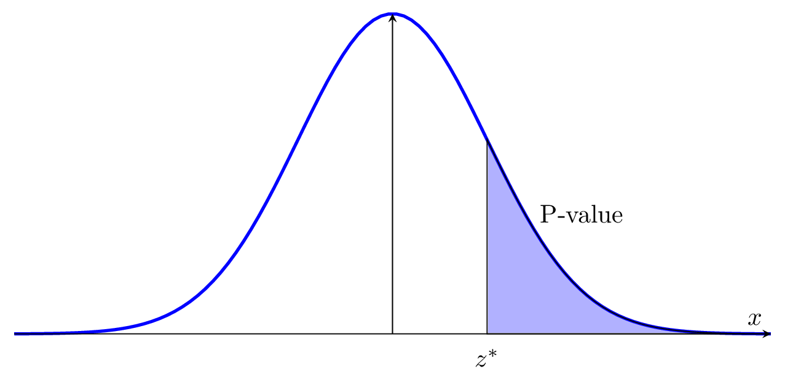
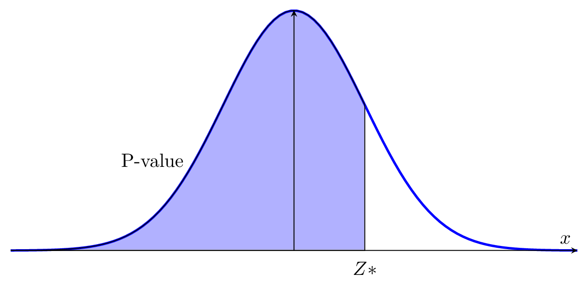
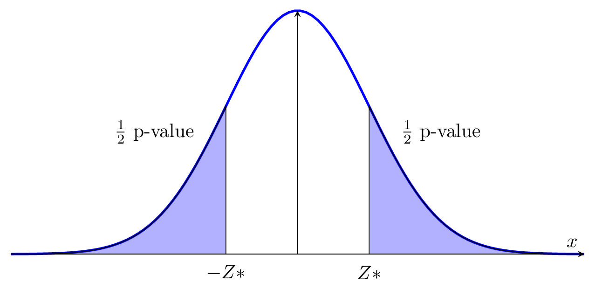

# One Sample Hypothesis Test on a Proportion and Variance

Inferential statistics is a powerful method for statistical analysis,
because it allows people to analyze a lot parameters. Similarly to
confidence interval, testing hypothesis can be applied to proportion and
variance as well. Also, we use the exact same structure for one sample
hypothesis test on a proportion and variance.

## One Sample Hypothesis Test on a Proportion

Suppose we have assume the proportion of a criteria from a population
$p$ is equal to our parameter $p_0$ (null hypothesis $H_0: p = p_0$).
While, the question is: how do we know whether our assumption is correct
or not? We need to use testing hypothesis on proportion to verify.\
**Step 1. Stating the Structure of Testing Hypothesis**

First of all, let's proceed with a table to see all the cases:

::: center
<figure>
<table>
<tbody>
<tr>
<td style="text-align: center;">Cases</td>
<td style="text-align: center;">Null Hypothesis</td>
<td style="text-align: center;">Alternative Hypothesis</td>
</tr>
<tr>
<td style="text-align: center;">1</td>
<td style="text-align: center;"><em>H</em>0 : <em>p</em> = <em>p</em>0</td>
<td style="text-align: center;"><em>H</em><em>a</em> : <em>p</em> &gt; <em>p</em>0</td>
</tr>
<tr>
<td style="text-align: center;">2</td>
<td style="text-align: center;"><em>H</em>0 : <em>p</em> = <em>p</em>0</td>
<td style="text-align: center;"><em>H</em><em>a</em> : <em>p</em> &lt; <em>p</em>0</td>
</tr>
<tr>
<td style="text-align: center;">3</td>
<td style="text-align: center;"><em>H</em>0 : <em>p</em> = <em>p</em>0</td>
<td style="text-align: center;"><em>H</em><em>a</em> : <em>p</em> ≠ <em>p</em>0</td>
</tr>
</tbody>
</table>
<figcaption>All possible cases of one sample hypothesis test on a
proportion (<em>p</em> represents the
actual proportion of a population)</figcaption>
</figure>
:::

We are not going to proceed with all three cases in a single question.
You need to be able to identify which case of testing hypothesis are
going to be applied from question.\
**Step 2. Computing Test Statistics**

After that we need to compute our test statistics, as the following
definition provides:

::: definition
The test statistics of one sample hypothesis test on a proportion is
given by:
$$Z^* = Z^* = \frac{\hat{p} - p_0}{ \sqrt{ \frac{p_0(1-p_0)}{n} } }.$$
In this case, $n$ means the sample size, $\hat{p}$ is the parameter of
the proportion of the population, which is calculated by
$\hat{p} = \frac{\text{number of successes in the sample}}{n}$. Also,
the reference distribution is standard normal distribution: $N(0,1)$.
:::

Note that be careful while you are computing the test statistics,
because it directly affects the final answer.\
**Step 3. Finding the $p$ - value**

i\. When is structure of testing hypothesis is $H_0: p = p_0$,
$H_a: p > p_0$:

<<<<<<< HEAD

=======

>>>>>>> BryanImages

In case (i), calculating $P[Z > Z_*]$ as your p-value. Then, comparing
with significant level: $\alpha$.

ii\. When is structure of testing hypothesis is $H_0: p = p_0$,
$H_a: p < p_0$:

<<<<<<< HEAD

=======

>>>>>>> BryanImages

In case (ii), calculating $P[Z < Z_*]$ as your p-value. Then, comparing
with significant level: $\alpha$.

iii\. When is structure of testing hypothesis is $H_0: p = p_0$,
$H_a: p \neq p_0$:

<<<<<<< HEAD

=======

>>>>>>> BryanImages

In case (iii), calculating $2\cdot P[Z > |Z_*|]$ as your p-value. Then,
comparing with significant level: $\alpha$.\
**Step 4: Comparing P-value with $\alpha$-level**

If p-value is less than $\alpha$-level, then we reject the null
hypothesis ($H_0$) and accept the alternative hypothesis ($H_a$).
Otherwise, If p-value is greater than $\alpha$-level, then we do not
reject the null hypothesis ($H_0$) and reject the alternative hypothesis
($H_a$).\
**Step 5: Final Conclusion** If we reject the null hypothesis, then we
conclude that: there is sufficient evidence to reject the null
hypothesis. If we do not reject the null hypothesis, then we conclude
that: there is insufficient evidence to reject the null hypothesis.\
**Conditions on One Sample Test Hypothesis on a Proportion**

- 1\. Random sample;

- 2\. Independent sample: each observations are independent to others;

- 3\. Sufficient sample.
